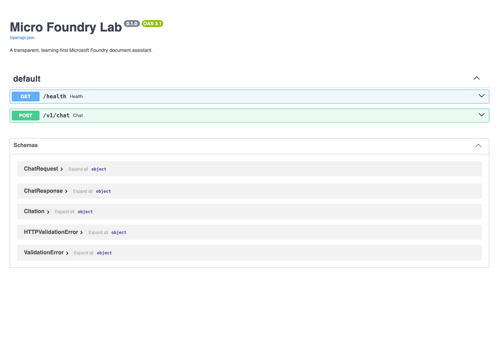
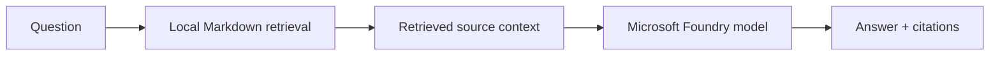

# Micro Foundry Lab

[](https://github.com/phlppgdfry/micro-foundry-lab/actions/workflows/quality.yml)
[](LICENSE)

A small, production-minded learning lab for [Microsoft Foundry](https://learn.microsoft.com/azure/foundry/). It starts with one model call and ends with a grounded document-assistant API—complete with source visibility, tests, and safe local configuration.

> **Why micro?** Learn one practical concept at a time, keep model usage controlled, and only add infrastructure once it earns its place.



## What you can do

- Send a first prompt to a Foundry model using your Azure identity.
- Ask questions about the Markdown documents in `data/`.
- Return the source files considered for each answer.
- Test the API interactively in Swagger UI or with `curl`.
- Build a small regression suite before changing prompts, models, or retrieval.

## How it works



The initial retrieval layer is deliberately simple and transparent: keyword matching over local Markdown files. It is designed for learning the complete grounding loop before moving to Azure AI Search or a vector store.

## Learning path

| Lab | Focus | Outcome |
| --- | --- | --- |
| 01 | Model call | Send a prompt to a Foundry model with Entra ID authentication. |
| 02 | Structured output | Treat model output as data to validate, not blindly trust. |
| 03 | Grounding | Retrieve local source documents and return citations. |
| 04 | Evaluation | Keep regression cases for useful, safe answers. |

## Prerequisites

- Python 3.11+
- An Azure subscription and a Microsoft Foundry project
- A deployed model, such as `gpt-5-mini`
- Azure CLI authenticated with `az login`

This project uses the current Foundry projects SDK (`azure-ai-projects` 2.x) and `DefaultAzureCredential`. You do **not** need to put an API key in this repository.

## Quick start

```bash
git clone https://github.com/phlppgdfry/micro-foundry-lab.git
cd micro-foundry-lab
python -m venv .venv
source .venv/bin/activate
pip install -e ".[dev]"
cp .env.example .env
az login
```

In Microsoft Foundry, copy the project endpoint from **Project overview**. It has this shape:

```text
https://<resource>.services.ai.azure.com/api/projects/<project>
```

Add it to `.env` together with your model deployment name:

```dotenv
FOUNDRY_PROJECT_ENDPOINT=https://<resource>.services.ai.azure.com/api/projects/<project>
FOUNDRY_MODEL=gpt-5-mini
```

`.env` is ignored by Git. Never commit secrets, tokens, customer documents, or production connection strings.

## Run it

### Lab 01 — first model call

```bash
python labs/01-chat/chat.py
```

You should receive a short response from your Foundry model.

### Document assistant API

```bash
uvicorn micro_foundry.main:app --reload
```

Open [http://127.0.0.1:8000/docs](http://127.0.0.1:8000/docs) for the interactive API. Check the service first:

```bash
curl http://127.0.0.1:8000/health
```

Then ask a question grounded in the example documents:

```bash
curl -X POST http://127.0.0.1:8000/v1/chat \
  -H 'Content-Type: application/json' \
  -d '{"question":"How long do employees have to submit expenses?"}'
```

Expected result: an answer that mentions **30 days** and cites `employee-handbook.md`.

## API contract

| Endpoint | Purpose |
| --- | --- |
| `GET /health` | Confirms that the API is running and shows the configured model. |
| `POST /v1/chat` | Answers a question and returns the local source files considered. |

Request body:

```json
{"question":"How long do employees have to submit expenses?"}
```

Response shape:

```json
{
  "answer": "...",
  "citations": [
    {"source": "employee-handbook.md", "relevance": 4}
  ]
}
```

## Authentication and safety

Local development uses `DefaultAzureCredential`, which normally picks up your Azure CLI identity after `az login`. For deployed applications, prefer a managed identity with only the least privilege it needs.

This is a learning project, not a complete production security boundary. Before exposing it publicly, add authentication, request limits, telemetry, content-safety checks, stricter retrieval thresholds, and a proper document store.

## Cost guardrails

- Begin with a small model and a small set of test documents.
- Create an Azure budget and a cost alert before experimenting.
- Keep the API local until authentication and rate limits are in place.
- Add evaluation cases deliberately: every model request has a cost.

## Troubleshooting

| Symptom | What to do |
| --- | --- |
| Swagger says **Failed to fetch** | Keep the `uvicorn` terminal open, then refresh `http://127.0.0.1:8000/docs`. |
| `FOUNDRY_PROJECT_ENDPOINT is not configured` | Create `.env` from `.env.example` and add your project endpoint. |
| Azure authentication fails | Run `az login`, select the subscription that owns the Foundry project, then retry. |
| Model not found | Set `FOUNDRY_MODEL` to the deployment name shown in Foundry. |

## Contributing and quality

```bash
ruff check .
pytest
```

See [CONTRIBUTING.md](CONTRIBUTING.md) and [SECURITY.md](SECURITY.md). The project is released under the [MIT License](LICENSE).

## Next improvements

1. Filter stop words and apply a minimum relevance threshold to retrieval.
2. Add validated structured output in Lab 02.
3. Replace local keyword retrieval with Azure AI Search or a vector store.
4. Add authentication, rate limiting, observability, and evaluation gates before public deployment.
